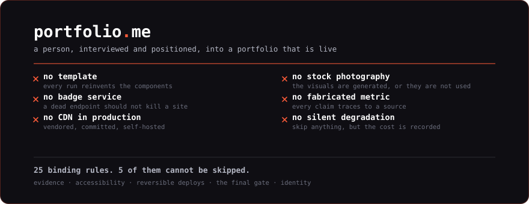
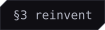
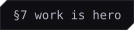
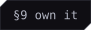
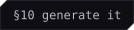
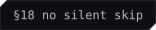
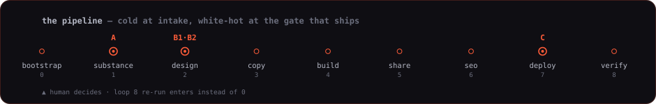
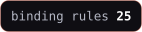

<p align="center">
  
</p>

<p align="center">
  
</p>

Every tool in this category hands you a template. This one is 6,600 lines of
refusal.

It turns a person into a portfolio that is live: interviewed, positioned, designed,
written, built, and deployed to infrastructure they picked. There is nothing to
install. The markdown is the product and your agent is the runtime.

## The rules it will not bend

<p>
  
  
  
  
  
</p>

Five of the twenty-five carry a lock. They are integrity rather than quality, so
they hold even when the human asks otherwise. The rest bend on request.

**Every claim traces to evidence.** A portfolio is a claim about a person, and a
fabricated metric is a lie told on their behalf to someone making a hiring
decision. No source, no ship.

**Accessibility basics.** Alt text, contrast, keyboard, and a *designed*
reduced-motion state rather than `animation: none` on a layout that assumed
movement.

**Deploy is reversible.** Snapshot before overwriting. The rollback command goes in
the report, because the person who needs it is reading at speed at a bad moment.

**Gate C.** Nothing becomes publicly visible under someone's name before they have
seen it. Not for time pressure, not because they said "just ship it" three loops
ago.

**Identity safety.** Push and deploy as the subject, with their credentials, then
switch back. A commit credited to the wrong person is not cosmetic.

The other twenty, at a cost stated once and written into the run:

<p>
  
  
  
  
  
  
  
</p>

## The pipeline

<p align="center">
  
</p>

Loop 1 decides the rest. The interview is the only source of the story, the voice,
and the strategy, and every later loop reads what it produced. Run it thin and you
get nine thin loops — no model in Loop 4 repairs a shallow Loop 1.

That is also why the cheap-early instinct is wrong here. What is genuinely
mechanical at the start is the scrape, and that runs at the bottom tier in
parallel while the interview happens ([`MODELS.md`](./MODELS.md)).

## What it refuses, and why

| Refusal | Because |
|---|---|
| No template | Two runs with the same archetype must not look alike. Every component is reinvented and the run records what it invented |
| No stock photography | Visuals are generated: CSS, SVG, canvas, WebGL, procedural. Generated imagery gets treated in-browser rather than dropped on the page raw |
| No badge service | A third-party endpoint going down leaves a broken site forever. Every asset here is a committed SVG, built by [`scripts/`](./scripts) |
| No CDN in production | Free rein while prototyping. Vendored, committed, and self-hosted before ship |
| No fabricated metric | Every number appears in `EVIDENCE.md` with a source, or it is attributed as speech, or it is cut |
| No silent degradation | Skip whatever you want. The skip and its cost go in `SKIPS.md` and into the confidence grade |
| No generated likeness | The one image never synthesized is the subject's own face |

## The craft

    

Advanced visual technique is the point. 72 techniques in
[`CRAFT.md`](./CRAFT.md) — raymarching and SDFs, curl-noise flow fields,
reaction-diffusion, GPGPU particles, post-processing, gooey SVG filters,
scroll-driven timelines, View Transitions, spring physics, variable fonts driven
across every axis, a designed preloader. Pull any library while prototyping. Look
anything up. The list is a floor.

48 styles in [`STYLES.md`](./STYLES.md), across seven families, and the useful part
is not the list. It is the **collision**: liquid glass over a blueprint substrate,
risograph texture on a Swiss grid, terminal chrome around a physics world. One
parent carries structure, the other carries surface. Two styles held in tension is
where the un-templated work lives, because a single named style is one search away
from being everyone else's site.

Three rules keep it honest. Every technique gets a runnable prototype before the
design depends on it. Every technique ships three states: full, designed
reduced-motion, and a no-WebGL fallback. And if the technique is more memorable
than the project it frames, it is the wrong technique.

## Deploy

Nine targets, with a subject's own server as a first-class option rather than a
fallback: GitHub Pages, Netlify, Vercel, Cloudflare Pages, VPS with nginx, VPS with
Docker, cPanel, S3 with CloudFront, and handoff.

The target constrains the stack, never the reverse. Each adapter in
[`deploy/`](./deploy) has the same shape — prerequisites, snapshot, deploy,
rollback, DNS and TLS, forms — so reading one teaches all nine.

## The doctrine

| File | Governs |
|---|---|
| [`PRINCIPLES.md`](./PRINCIPLES.md) | 25 binding rules, 5 of them hard |
| [`BRAND.md`](./BRAND.md) | Archetype, positioning, voice, the translation table |
| [`ARCHITECTURE.md`](./ARCHITECTURE.md) | How many pages, routing, and the blog |
| [`STYLES.md`](./STYLES.md) | What it looks like, and how to collide two |
| [`CRAFT.md`](./CRAFT.md) | How it renders |
| [`MODELS.md`](./MODELS.md) | Which model tier runs which step |
| [`SKIPPING.md`](./SKIPPING.md) | What each step costs to leave out |
| [`AGENTS.md`](./AGENTS.md) | The universal entry point for any agent |

## Run it

```
/portfolio.me <name or handle>          # Claude Code
```

Anywhere else, point your agent at [`AGENTS.md`](./AGENTS.md) and name the subject.
Configs ship for Cursor, Codex, Gemini, opencode, Cline, and Windsurf. A platform
without subagents runs the same loops sequentially.

Two scripts, standard library only, no dependencies:

```bash
python3 scripts/preflight.py <dir | file | url>   # the mechanical half of Gate C
python3 scripts/badge.py                          # regenerate the artwork
```

`preflight.py` checks what a machine can check: alt text, reduced-motion states,
`lang`, CDN assets, hotlinked stock, trackers, the share layer, the shell budget,
and whether every figure on the site appears in `EVIDENCE.md`. It does not judge
design, prose, or truth. That stays the human's call at the gate.

## Lineage

Sibling of [git-a-profile](https://github.com/PIIIX-org/git-a-profile), which does
this for a GitHub README. Same shape, harder problem: a README can be built from an
API, and a portfolio cannot. The story only exists in the subject's head, which is
why this one opens with an interview and not a scrape.

Built by [PIIIX](https://github.com/PIIIX-org). MIT.

<!-- forged-with: git-a-profile -->
